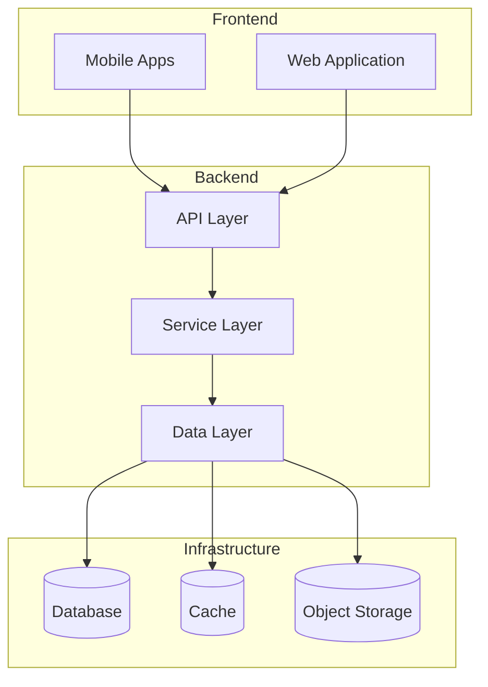
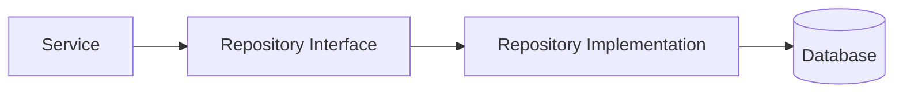
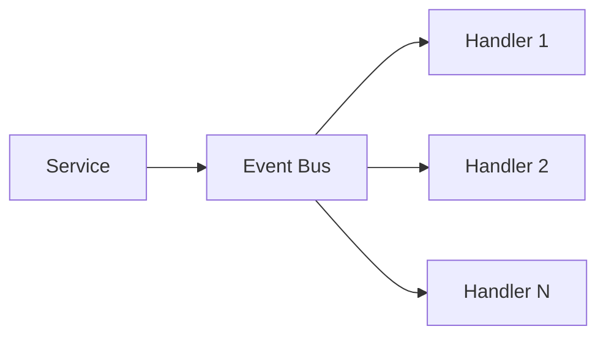
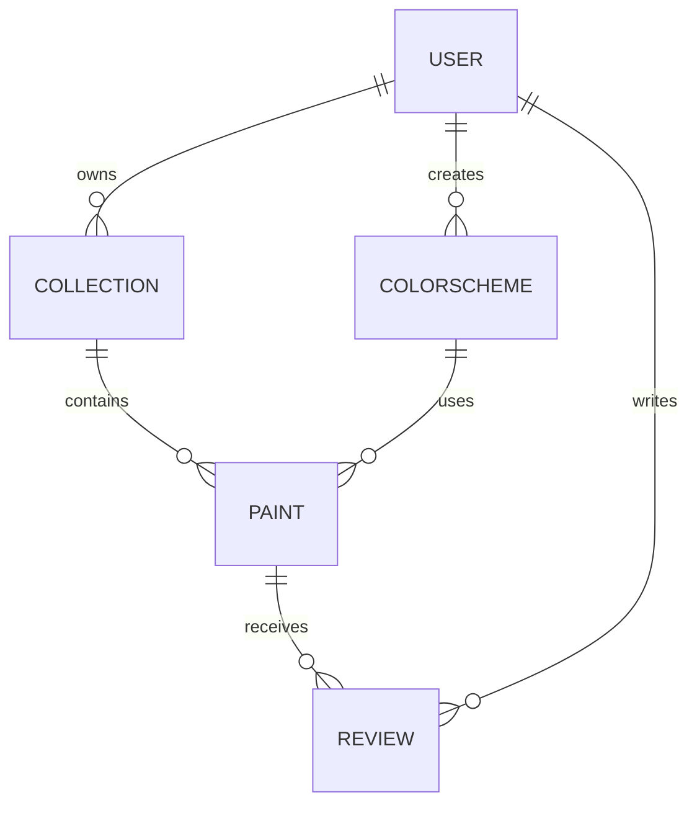

# System Patterns: ColorAgent

## Architecture Overview

ColorAgent follows a modern, scalable architecture with clear separation of concerns:



## Key Design Patterns

### Repository Pattern
Used for data access abstraction, allowing the application to work with a simple abstraction that has an interface similar to a collection for accessing data stored in the database.



### Service Layer Pattern
Defines an application's boundary and its set of available operations from the perspective of interfacing client layers.

### CQRS (Command Query Responsibility Segregation)
Separates read and update operations for data stores:
- Commands: Change state, don't return data
- Queries: Return data, don't change state

### Event-Driven Architecture
For certain features like real-time updates and notifications:



## Data Models

### Core Entities

1. **Paint**
   - Unique identifier
   - Manufacturer
   - Product line
   - Name
   - Color data (RGB, HSV, Lab)
   - Properties (finish, opacity, etc.)
   - Metadata (release date, discontinued status)

2. **User**
   - Authentication info
   - Profile data
   - Preferences
   - Subscription status

3. **Collection**
   - Owner (User)
   - Paints (with quantity, purchase date, etc.)
   - Organization (tags, categories)
   - Sharing settings

4. **ColorScheme**
   - Creator (User)
   - Name and description
   - Colors/Paints
   - Tags
   - Visibility settings

### Relationships



## API Design

RESTful API with resource-oriented endpoints:

- `/api/paints` - Paint database operations
- `/api/users` - User management
- `/api/collections` - Collection CRUD
- `/api/schemes` - Color scheme operations
- `/api/search` - Search functionality

GraphQL API for complex queries and data fetching optimization.

## Security Patterns

- JWT-based authentication
- Role-based access control
- Rate limiting
- Input validation and sanitization
- Data encryption at rest and in transit

## Caching Strategy

- Redis for application-level caching
- CDN for static assets
- Browser caching with appropriate cache headers
- Cache invalidation through versioned URLs and cache busting

## Error Handling

Standardized error response format:

```json
{
  "error": {
    "code": "ERROR_CODE",
    "message": "Human-readable message",
    "details": { /* Additional context */ }
  }
}
```

Comprehensive error logging with contextual information.

## Performance Considerations

- Pagination for large data sets
- Lazy loading of non-critical data
- Database query optimization
- Image optimization and responsive delivery
- Background processing for intensive operations

## Testing Strategy

- Unit tests for business logic
- Integration tests for API endpoints
- End-to-end tests for critical user flows
- Performance testing for key operations
- A/B testing for UX improvements
